# Ejercicio Práctico - Servidor Web en Node (JSON) + Cliente REST: Gestión de Productos

Se creó un servidor en **Node.js** que entregue datos en formato JSON y una página web que consuma esos datos.
La página permite listar productos y agregar nuevos productos, los cuales se guardan en un archivo `.txt`.

## Iniciar proyecto Node

Primero abrí la carpeta del proyecto en Visual Studio Code y ejecuté:

npm init -y

Esto creó automáticamente el archivo `package.json`.

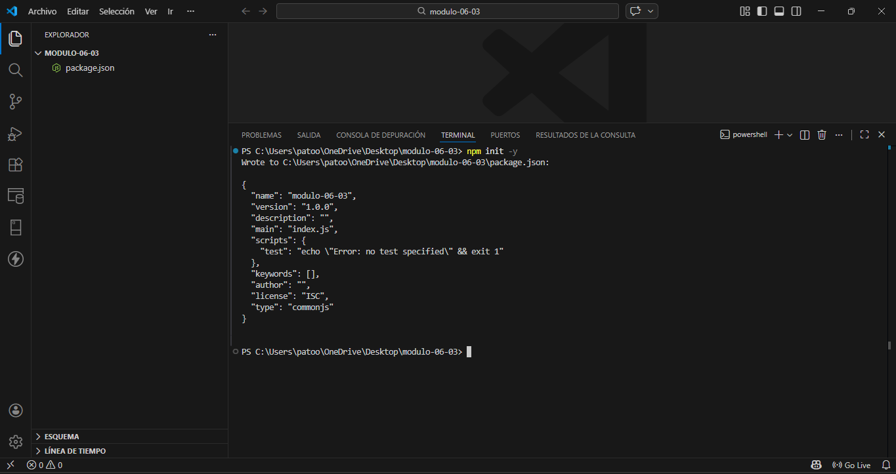

## Instalar Express

Luego instalé Express, que se usará para crear el servidor web:

npm install express

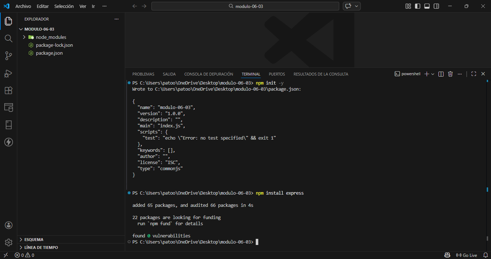

## Crear archivo de datos

Creé el archivo `productos.txt`.
Aquí se guardarán los productos.
Cada línea representa un producto en el formato:

nombre,precio

Ejemplo:

Zapatillas,25990
Jeans,12990
Polera,8990
Gorro,5990

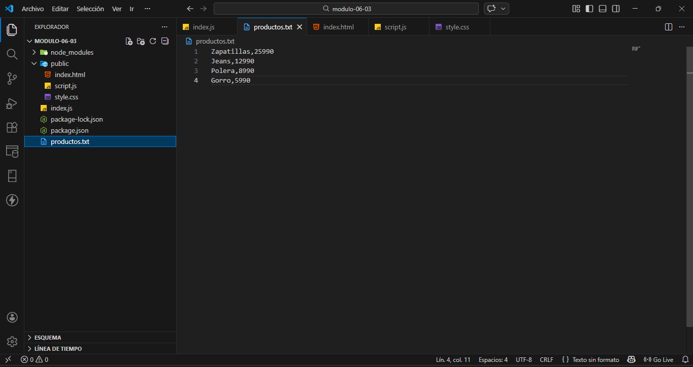

## Crear el servidor (index.js)

Luego creé el archivo `index.js`, donde se configura Express:

* Se usa `express.json()`
* Se publica la carpeta `public`
* Se crean rutas GET y POST

El servidor corre en el puerto 3000.

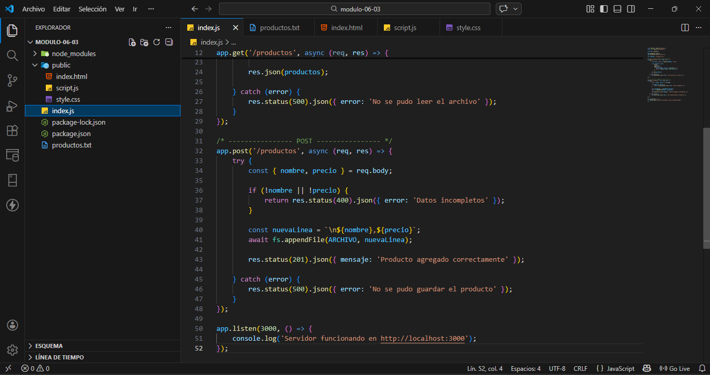

Para levantarlo:

node index.js

## Crear la página web

Se creó una carpeta `public` con:

* `index.html`
* `script.js`
* `style.css`

La página tiene:

* Un botón para listar artículos
* Un formulario para agregar productos

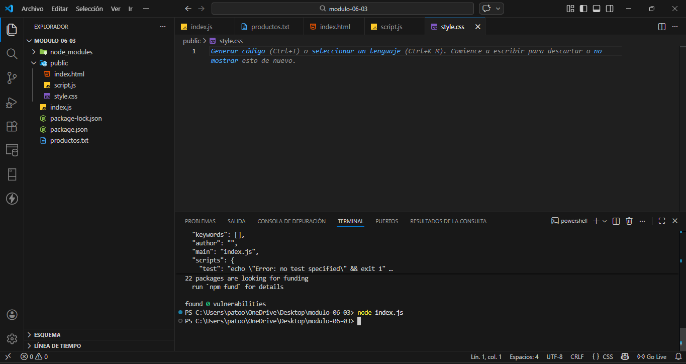
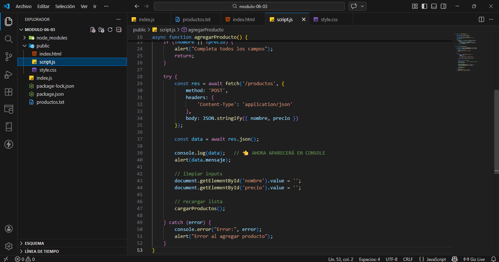

## Método GET (listar productos)

Se creó la ruta:

GET /productos

El servidor lee `productos.txt`, lo transforma a JSON y lo envía al navegador.

Al presionar **LISTA DE ARTÍCULOS** se muestran ordenados en la página.

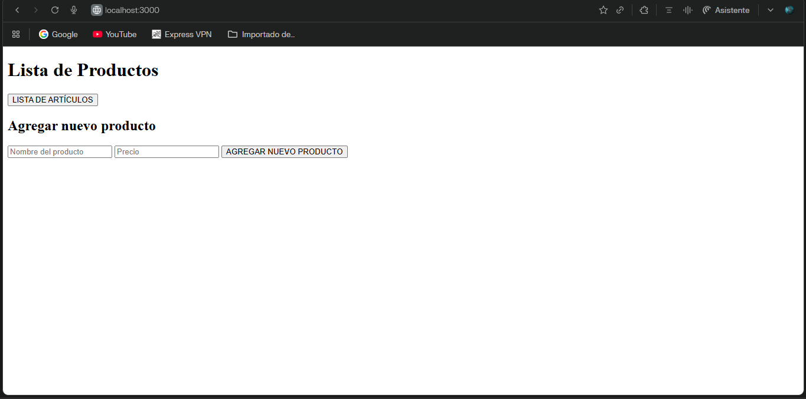
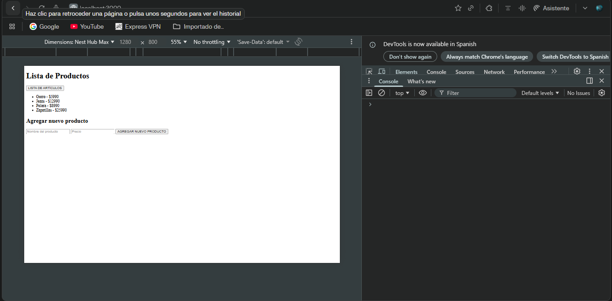

## 7. Método POST (agregar producto)

Se creó la ruta:

POST /productos

El formulario envía:

* nombre
* precio

El servidor agrega una nueva línea al archivo `productos.txt`.

Si funciona, aparece un mensaje:

> "Producto agregado correctamente"

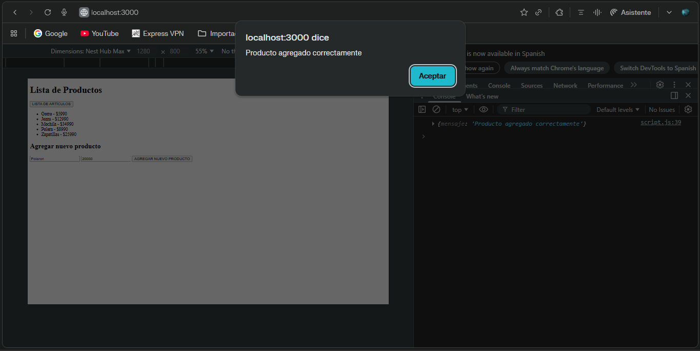
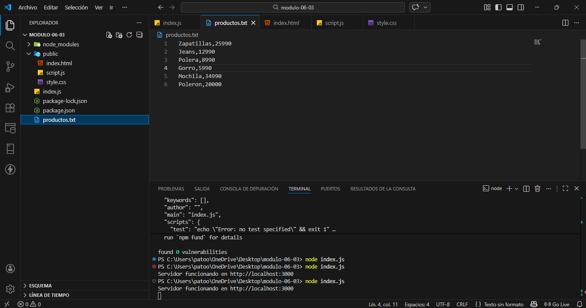

## 8. Reiniciar servidor

Cada vez que se modifica el código del servidor es necesario detenerlo y ejecutarlo nuevamente:

Ctrl + C
node index.js

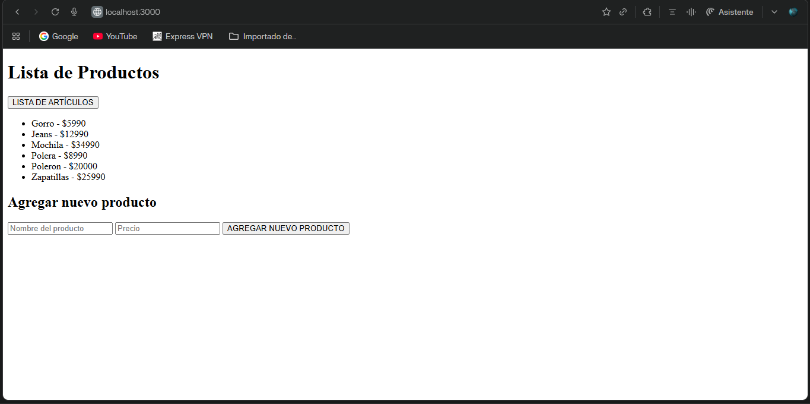

## Cómo ejecutar el proyecto

1. Instalar dependencias:

npm install

2. Levantar servidor:

node index.js

3. Abrir en navegador:

http://localhost:3000

## Archivos

- `img/`: Carpeta donde guardé todas las capturas de pantalla del desarrollo y pruebas de la API para que se vean en este README.
- `public/`: Carpeta pública que el servidor entrega al navegador (la página web del cliente).

    - `index.html`: Página principal donde se ve la lista de productos y el formulario para agregar uno nuevo.
    - `script.js`: Código JavaScript del navegador. Aquí se hace el `fetch` al servidor para obtener los productos (GET) y para agregarlos (POST).
    - `style.css`: Estilos básicos de la página (diseño simple de la interfaz).

- `index.js`:  Archivo principal del servidor Node. Aquí se configura Express, se crea el servidor en el puerto 3000 y se programan las rutas.
- `productos.txt`: Base de datos simple en texto plano. Cada línea representa un producto con formato.
- `.gitignore`: Archivo para que GitHub no suba la carpeta node_modules ni archivos innecesarios.
- `package.json`: Contiene la información del proyecto y las dependencias usadas (express, pg, cors).
- `package-lock.json`: Archivo que se genera automáticamente al instalar las dependencias.
- `README.md`: Documento donde explico paso a paso cómo hice el proyecto y cómo probar la API.

## Autor

Patricio Valenzuela

## Repositorio GitHub

https://github.com/PATRICIORVH/modulo-06-03